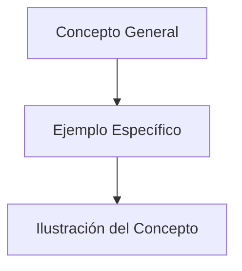

> [!info] [[definicion|Definición]]
> Un ejemplo es una instancia específica que ilustra o clarifica un concepto, teoría o principio, proporcionando una representación concreta de lo que se describe.

> [!quote] Contexto
> Los ejemplos son herramientas pedagógicas esenciales que ayudan a comprender mejor los conceptos abstractos al proporcionar casos concretos y aplicables.
>

> [!example] [[ejemplo|Ejemplo]]
> Un ejemplo de un concepto matemático es el teorema de Pitágoras, que establece que en un triángulo rectángulo, el cuadrado de la hipotenusa es igual a la suma de los cuadrados de los catetos. Un ejemplo específico sería un triángulo con catetos de longitud 3 y 4, donde la hipotenusa mediría 5 unidades.
>

> [!seealso] Ver también
> - [Definición](definicion.md)