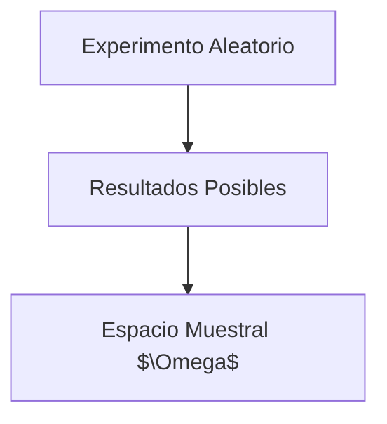

---
tags:
  - definicion
title: Espacio Muestral
draft: false
---

> [!info] [[definicion|Definición]]
> El espacio muestral es el conjunto de todos los resultados posibles de un experimento aleatorio. Se denota comúnmente como $\Omega$ y es fundamental en la teoría de la probabilidad.


> [!quote] Contexto
> El espacio muestral es esencial para definir eventos y calcular probabilidades. Cada resultado en el espacio muestral es un punto de partida para el análisis probabilístico.

> [!example] Ejemplo
> Un ejemplo de espacio muestral es el lanzamiento de un dado. El espacio muestral $\Omega$ sería $\{1, 2, 3, 4, 5, 6\}$, ya que estos son los resultados posibles al lanzar un dado de seis caras.
> ```mermaid
> flowchart TD
>   A["Lanzamiento de un Dado"]
>   B["Resultados Posibles"]
>   C["Espacio Muestral $\Omega = \{1, 2, 3, 4, 5, 6\}$"]
>   A --> B
>   B --> C
> ```