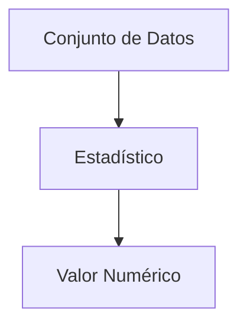

---
tags:
  - definicion
title: Estadístico
draft: false
---
> [!info] [[definicion|Definición]]
> Un estadístico es una [[funcion|función]] que toma un [[conjunto|conjunto]] de datos y produce un valor numérico que resume o describe alguna característica de esos datos. Los estadísticos son fundamentales en la estadística para inferir propiedades de una [[poblacion|población]] a partir de una muestra.


> [!quote] Contexto
> Los estadísticos son herramientas clave en el análisis de datos, ya que permiten resumir información compleja y facilitar la toma de decisiones basadas en datos. Se utilizan en diversas áreas, como la investigación científica, la economía y la ingeniería.
>

> [!example] [[ejemplo|Ejemplo]]
> Un ejemplo de estadístico es la media aritmética, que se calcula sumando todos los valores de un conjunto de datos y dividiendo por el número total de valores. Por ejemplo, si tenemos los datos $\{2, 4, 6, 8\}$, la media sería $(2 + 4 + 6 + 8) / 4 = 5$.
> ```mermaid
> flowchart TD
>   A["Datos: {2, 4, 6, 8}"]
>   B["Suma: 2 + 4 + 6 + 8 = 20"]
>   C["Número de Valores: 4"]
>   D["Media: 20 / 4 = 5"]
>   A --> B
>   A --> C
>   B --> D
> ```