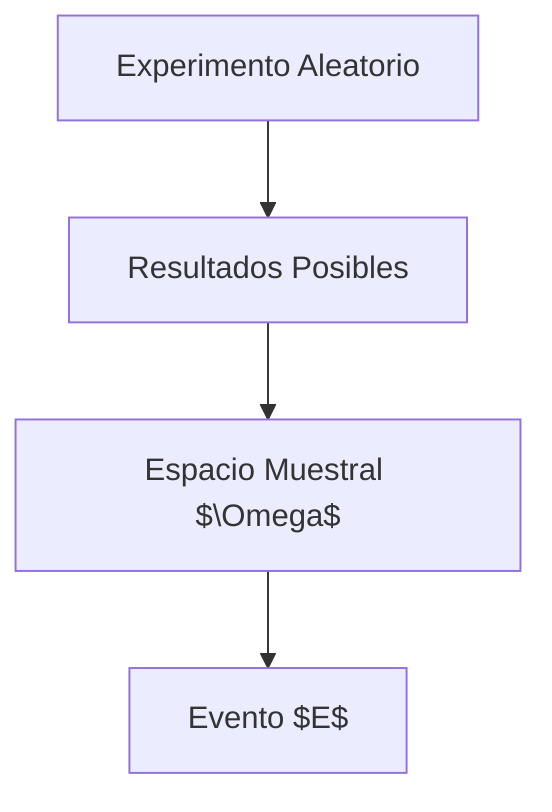

---
tags:
  - definicion
title: Evento
draft: false
---
> [!info] [[definicion|Definición]]
> Un evento es un conjunto de resultados de un experimento aleatorio. Se denota comúnmente como $E$ y puede ser un subconjunto del espacio muestral $\Omega$. Los eventos pueden ser simples (un solo resultado) o compuestos (varios resultados).


> [!quote] Contexto
> Los eventos son fundamentales en la teoría de la probabilidad, ya que permiten definir situaciones específicas dentro del espacio muestral y calcular probabilidades asociadas a esos eventos.
>

> [!example] Ejemplo
> Un ejemplo de evento es el lanzamiento de un dado. Si consideramos el evento $E$ de obtener un número par, entonces $E = \{2, 4, 6\}$, que es un subconjunto del espacio muestral $\Omega = \{1, 2, 3, 4, 5, 6\}$.
> ```mermaid
> flowchart TD
>   A["Lanzamiento de un Dado"]
>   B["Resultados Posibles"]
>   C["Espacio Muestral $\Omega = \{1, 2, 3, 4, 5, 6\}$"]
>   D["Evento $E = \{2, 4, 6\}$"]
>   A --> B
>   B --> C
>   C --> D
> ```