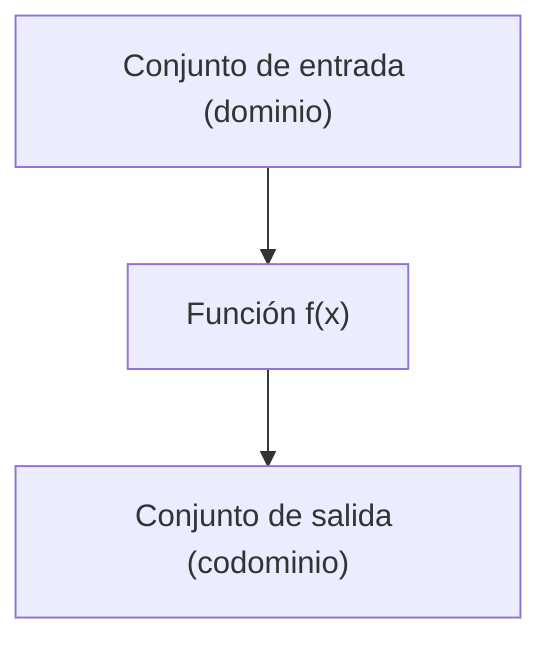

---
tags:
  - definicion
title: Función
draft: false
---
> [!info] [[definicion|Definición]]
> Una función es una relación entre dos conjuntos, donde a cada elemento del primer conjunto (dominio) le corresponde exactamente un elemento del segundo conjunto (codominio). 
> $f: A \to B$ indica que $f$ es una función que asigna elementos del conjunto $A$ al conjunto $B$.



> [!quote] Contexto
> Las funciones son fundamentales en matemáticas, ya que permiten modelar relaciones y transformaciones entre variables.

> [!example] [[ejemplo|Ejemplo]]
> La función cuadrática $f(x) = x^2$ asigna a cada número real $x$ su cuadrado. Por ejemplo, $f(3) = 9$ y $f(-2) = 4$.
> ```mermaid
> flowchart TD
>   A["x = 3"]
>   B["f(x) = x^2"]
>   C["f(3) = 9"]
>   A --> B
>   B --> C
> ```