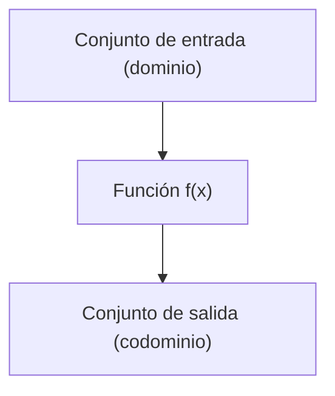

---
tags:
  - definicion
title: Función
draft: false
video:
  - http://commons.wikimedia.org/wiki/Special:FilePath/-bertsomate-%20Funtzioak.webm
  - http://commons.wikimedia.org/wiki/Special:FilePath/%D0%A4%D1%83%D0%BD%D0%BA%D1%86%D0%B8%D0%B8.webm
  - http://commons.wikimedia.org/wiki/Special:FilePath/Bijektivit%C3%A4t%20von%20Funktionen-%20Quatematik.webm
  - http://commons.wikimedia.org/wiki/Special:FilePath/Surjektivit%C3%A4t%20von%20Funktionen-%20Quatematik.webm
imagen:
  - http://commons.wikimedia.org/wiki/Special:FilePath/Exp%20re.png
  - http://commons.wikimedia.org/wiki/Special:FilePath/Graph%20of%20function%20of%202%20variables.png
instancia de: "[[concepto matemático]]"
subclase de: "[[relación binaria]]"
opuesto a: "[[función multivaluada]]"
compuesto por:
  - "[[mapa]]"
  - "[[argumento de una función]]"
  - "[[aridad]]"
  - "[[valor de una función]]"
categoría principal del tema: "[[Categoría_Funciones]]"
notación: "[[Q6754055]]"
descrito en la URL:
  - https://www.khanacademy.org/math/algebra/x2f8bb11595b61c86:functions
  - https://www.khanacademy.org/math/linear-algebra/matrix-transformations/linear-transformations/v/a-more-formal-understanding-of-functions
descrito en la fuente:
  - "[[Diccionario Enciclopédico Brockhaus y Efron]]"
  - "[[Encyclopædia Britannica (11ª edición)]]"
  - "[[Enciclopedia soviética armenia]]"
  - "[[Pequeño diccionario enciclopédico de Brockhaus y Efron]]"
  - "[[Q19219752]]"
  - "[[Q109490582]]"
plantilla principal del tema: "[[Q13411594]]"
caracterizado por:
  - "[[dominio de definición]]"
  - "[[codominio]]"
  - "[[raíz de una función]]"
  - "[[tipo de función matemática]]"
  - "[[Q54933376]]"
  - "[[Q54933381]]"
diferente de: "[[cargo]]"
propiedades de Wikidata para este tipo:
  - dominio
  - codominio
  - imagen de la función
lista del elemento: "[[Anexo_Funciones matemáticas]]"
estudiado por: "[[matemáticas]]"
lista de interés para el proyecto Wikimedia:
  - "[[Wikipedia_Lista de artículos que toda Wikipedia debería tener]]"
  - "[[Wikipedia_Lista de artículos que toda Wikipedia debería tener_Expandida]]"
mantenido por el wikiproyecto: "[[Wikiproyecto_Matemáticas]]"
propiedad inadecuada para este tipo:
  - país
  - campo de trabajo
  - fecha de fundación o creación
  - fecha de disolución, retirada o demolición
  - titular del cargo
  - organización dirigida desde este cargo
identificador GND (DNB): 4071510-3
identificador de autoridades de la Biblioteca del Congreso de EE. UU.: sh85052327
identificador BnF: 11946892t
identificador NDL: "00564960"
categoría en Commons: Functions (mathematics)
identificador Thesaurus BNCF: "19483"
Identificador Freebase: /m/02v_93z
identificador NKC: ph114594
identificador Tesauro de arte y arquitectura: "300055662"
identificador PSH: "7426"
Identificador Enciclopedia Británica Online: topic/function-mathematics
identificador YSO: "7097"
identificador BabelNet: 00036821n
identificador MathWorld: Function
identificador Enciclopedia Treccani on line: funzione
identificador de tema en Quora: Functions-mathematics
ID de tema en Zhihu: "19599298"
identificador Cultureel Woordenboek: wiskunde/functie
identificador JSTOR de tema: mathematical-functions
identificador nLab: function
identificador de la Enciclopedia Italiana Treccani: funzione
identificador Store norske leksikon: funksjon_-_matematikk
P5106: function
P5844: funzione_res-f4951c70-dff0-11eb-94e0-00271042e8d9
identificador Larousse: divers/fonction/52836
identificador de artículo en Fandom Wikia: math:Function
identificador Microsoft Academic:
  - "145877681"
  - "58442840"
identificador de artículo Krugosvet: nauka_i_tehnika/matematika/FUNKTSIYA.html
identificador Brilliant Wiki: functions
identificador De Agostini: funzione+(matematica)
NicoNicoPedia ID: 関数
P7305: "3903278"
tipo de entidad en Wolfram Language: MathematicalFunction
P7554: Function
identificador J9U de la Biblioteca Nacional de Israel: "987007553160705171"
identificador Lex:
  - afbildning
  - funktion
identificador en KBpedia: Function-Mathematic
identificador de synset de WordNet 3.1: 13806028-n
número IEV: 102-01-10
identificador en Namuwiki: 함수
P9621: funzione
P9941: funzione-matematica
P9983: funzioni
identificador de la Enciclopedia de la China (tercera edición): "111680"
P11514: funktsiia-fc637f
identificador de la Gran Enciclopedia Catalana: funcio-3
P12596: "19965"
identificador de artículo en Vikidia: fr:Fonction_(mathématiques)
P12888:
  - df-f
  - df-fn
  - df-fun
P13591: concept/273d7a84-0d4e-4de5-a067-5a182bbff790
EntityID: Q11348
---

> [!info] [[definicion|Definición]]
> Una función es una relación entre dos conjuntos, donde a cada elemento del primer conjunto (dominio) le corresponde exactamente un elemento del segundo conjunto (codominio).
> $f: A \to B$ indica que $f$ es una función que asigna elementos del conjunto $A$ al conjunto $B$.


```mermaid
flowchart TD
  A["Conjunto de entrada (dominio)"]
  B["Conjunto de salida (codominio)"]
  C["Función f(x)"]
  A --> C
  C --> B
```

> [!quote] Contexto
> Las funciones son fundamentales en matemáticas, ya que permiten modelar relaciones y transformaciones entre variables.

> [!example] [[ejemplo|Ejemplo]]
> La función cuadrática $f(x) = x^2$ asigna a cada número real $x$ su cuadrado. Por ejemplo, $f(3) = 9$ y $f(-2) = 4$.
>
> ```mermaid
> flowchart TD
>   A["x = 3"]
>   B["f(x) = x^2"]
>   C["f(3) = 9"]
>   A --> B
>   B --> C
> ```
