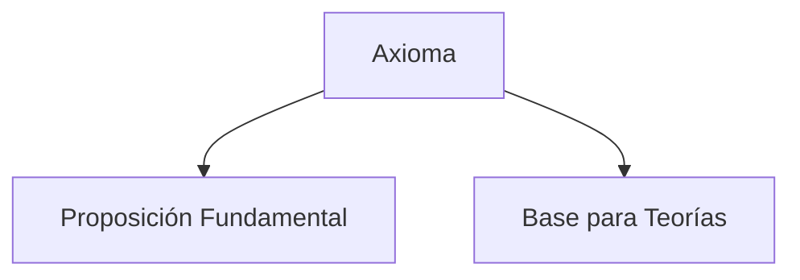

> [!info] [[definicion|Definición]]
> Un axioma es una proposición o principio fundamental que se acepta sin necesidad de demostración, sirviendo como base para el desarrollo de teorías y sistemas lógicos.

> [!quote] Contexto
> Los axiomas son esenciales en matemáticas y lógica, ya que establecen los fundamentos sobre los cuales se construyen teoremas y teorías más complejas.
>

> [!example] Ejemplo
> Un ejemplo de axioma es el "axioma de la recta", que establece que por dos puntos distintos pasa una única recta. Este axioma es fundamental en la geometría euclidiana y no requiere demostración, ya que se acepta como una verdad evidente.
>