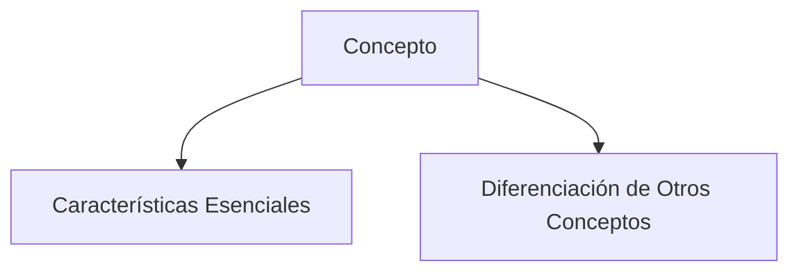

> [!info] Definición
> Una definición es una descripción precisa y concisa de un concepto, término o entidad, que establece sus características esenciales y lo distingue de otros conceptos relacionados.

> [!quote] Contexto
> Las definiciones son fundamentales en el estudio de las matemáticas y otras disciplinas, ya que proporcionan un marco claro para entender y comunicar ideas complejas.

> [!example] Ejemplo
> Un ejemplo de definición es "un triángulo es una figura geométrica formada por tres lados y tres ángulos, donde la suma de los ángulos internos es siempre 180 grados". Esta definición establece las características esenciales del triángulo y lo distingue de otras figuras geométricas.