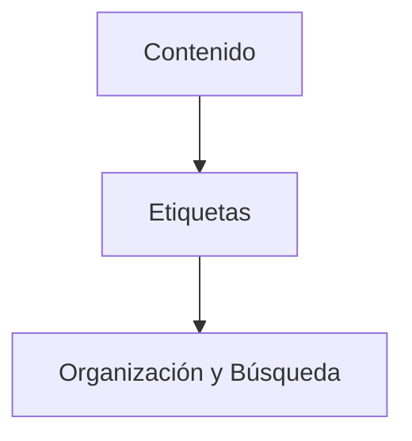

> [!info] [[definicion|Definición]]
> Las etiquetas son palabras clave o términos que se utilizan para categorizar y organizar contenido, facilitando su búsqueda y navegación.

> [!quote] Contexto
> Las etiquetas son fundamentales en la organización de información digital, permitiendo a los usuarios encontrar rápidamente contenido relevante y relacionado. Se utilizan ampliamente en blogs, redes sociales y bases de conocimiento.
>

> [!example] Ejemplo
> Un ejemplo de uso de etiquetas es en un blog, donde cada entrada puede tener varias etiquetas como "tecnología", "salud" o "educación", lo que permite a los lectores filtrar y encontrar artículos relacionados con sus intereses específicos.